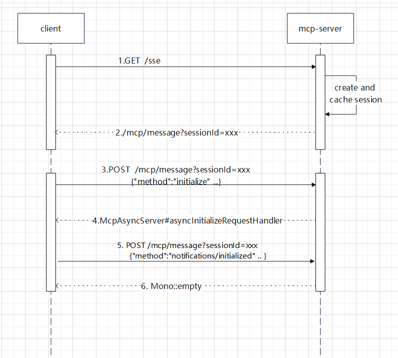

# MCP WEBFLUX 示例项目

MCP webflux 是基于SSE传输的, mcp webflux 初始化的交互过程如图


时序图说明

步骤2 返回sse
```text
event:endpoint
data:/mcp/message?sessionId=3e89acfb-8cc1-4a09-be3e-b1c18e0a62e4
```
步骤3 请求json
```json
{"method":"initialize","params":{"protocolVersion":"2025-06-18","capabilities":{"sampling":{},"roots":{"listChanged":true}},"clientInfo":{"name":"mcp-inspector","version":"0.16.1"}},"jsonrpc":"2.0","id":0}
```
步骤4 返回sse
```text
event: message
data: {"jsonrpc":"2.0","id":0,"result":{"protocolVersion":"2024-11-05","capabilities":{"completions":{},"logging":{},"prompts":{"listChanged":true},"resources":{"subscribe":false,"listChanged":true},"tools":{"listChanged":true}},"serverInfo":{"name":"mcp-server","version":"1.0.0"}}}
```
步骤5 请求json 通知服务端,客户端已初始化完成
```json
{"method":"notifications/initialized","jsonrpc":"2.0"}
```
由于SSE是长连接,并且服务端用的MAP内存缓存的session信息，
如果部署多个节点之后，请求网关经过负载均衡之后， 可能会到达不同的节点。
因此, 可以使用iphash负载均衡，参考示例项目
[https://github.com/shootercheng/gateway](https://github.com/shootercheng/gateway)